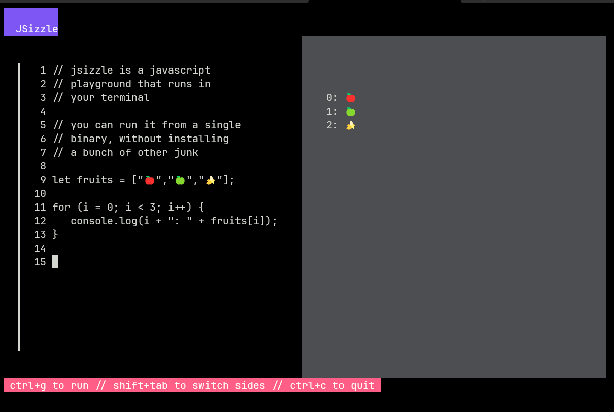

# JSizzle

JSizzle is a JavaScript playground that doesn't require that you install a bunch
of other junk to play.

I made this so I can teach the very basics of computer programming to students using
a simple and forgiving language without requiring them to know about compilers,
the horror of installing Python 🤮 or Node/NPM 💀.

Install it by downloading the appropriate file on the Releases page at right and copying it
to your Desktop. Open your computer's Terminal application, change to the Desktop folder
using the `cd` command, then type `jsizzle`.

If you find this useful, (1) hug your loved ones, then (2) find some way to speak out
against fascism and genocide.

Thanks to these folks for inspiration and the work they share:

* [Charm](https://github.com/charmbracelet)
* [Goja](https://github.com/dop251/goja)
* [Runal](https://github.com/emprcl/runal)
